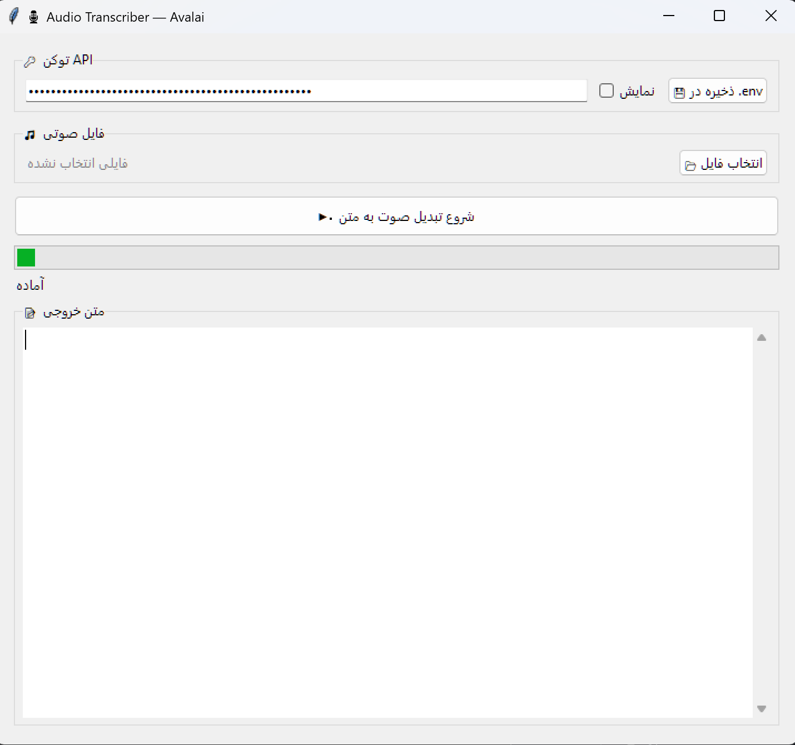

# 🎙️ Audio Transcriber GUI with AvalAI

A simple yet production-ready desktop application built with Tkinter for Persian speech-to-text transcription using AvalAI's audio transcription API.  
The app allows users to save their API token in a `.env` file, upload audio files such as `.mp3`, and receive transcribed text in a clean graphical interface.

---

## ✨ Features

- Save API token securely in `.env`
- Select and transcribe `.mp3` audio files
- Persian transcription support
- Tkinter desktop GUI
- Retry logic for timeout and connection issues
- Environment validation with `env_utils.py`
- `uv`-based setup for reproducible execution

---

## 🧱 Tech Stack

- Python 3.11+
- Tkinter
- Requests
- Python-dotenv
- AvalAI API
- uv

---

## 📁 Project Structure

```text
audio-transcriber/
├── src/audio_transcriber/
├── env_utils.py
├── pyproject.toml
├── .env.example
├── README.md
└── LICENSE
```

---

## ⚙️ Prerequisites

Before running the project, make sure you have installed:

- Python 3.11+
- [uv](https://docs.astral.sh/uv/)
- ffmpeg (optional, if you later enable chunking for long audio files)

---

## 🚀 Quick Start

### 1. Clone the repository

```bash
git clone https://github.com/aminmotamedi1400/audio-transcriber.git
cd audio-transcriber
```

### 2. Create `.env`

```bash
cp .env.example .env
```

Then set your API key:

```env
API_KEY=your_avalai_api_key_here
```

### 3. Sync dependencies

```bash
uv sync
```

### 4. Validate environment

```bash
uv run python env_utils.py
```

### 5. Run the app

```bash
uv run python src/audio_transcriber/gui.py
```

---

## 🔐 Environment Variables

| Variable | Required | Description |
|----------|----------|-------------|
| `API_KEY` | Yes | AvalAI API token |

---

## 🖼️ Screenshots

### Main GUI


---

## 🧪 Environment Check Utility

This repository includes `env_utils.py`, which validates:

- virtual environment setup
- installed packages
- required environment variables
- system tools such as `ffmpeg`

Run:

```bash
uv run python env_utils.py
```

---

## 📌 Notes

- Do not commit your real `.env` file
- Use `.env.example` as a template
- For long audio files, ffmpeg-based chunking can be added later

---

## 📜 License

MIT License

---

## 🙌 Acknowledgments

Inspired by clean open-source project structures and agentic AI repositories.
